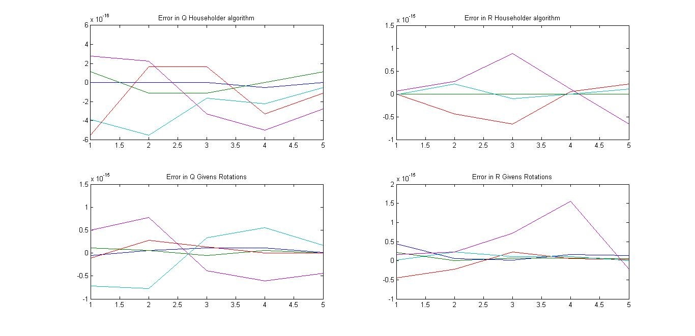
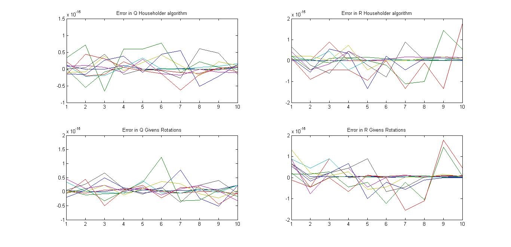

# Singular-Value-Decomposition

#### SVD
Singular Value Decomposition (SVD) factorizes any real matrix A into a product of three matrices S, U and V.  Matrix S is a diagonal matrix containing the singular values matrix A arranged in descending form. Matrices U and V are orthogonal such as U contains the left singular vectors whereas V contains the right singular vectors. This work uses One Sided Jacobi algorithm to calculate SVD. The Jacobi rotations are calculated on every 2 × 2 submatrix to zero out all non-zero off-diagonal elements of the original matrix. Number of iterations implemented are 5 which are used to converge. The high accuracy of the algorithm can be seen from the error plot.

#### Error Range
1.	Floating Point function and MATLAB function: 10-16 – 10-15
2.	Floating Point function and Fixed Point function: 10-6 – 10-4

#### Error Plot

#### QR Decompostion
Implemented QR Decomposition using Householder Reflections algorithm and Givens Rotations algorithm

#### Error Plot
n=4

n=5

n=10

#### References
Ali Ibrahim, Maurizio Valle, Luca Noli and Hussein Chible, Assessment of FPGA Implementations of One Sided Jacobi Algorithm for Singular Value Decomposition. 2015 IEEE Computer Society Annual Symposium on VLSI.

[1] C. Studer, P. Blösch, P. Friedli, and A. Burg, Matrix Decomposition Architecture for MIMO Systems: Design and Implementation Trade-offs. Integrated Systems Laboratory, ETH Zurich, Switzerland.
[2] Z. Liu, K. Dickson and J. V. McCanny, A floating-point CORDIC based SVD processor. DSiP Laboratories, Queen’s University of Belfast, Belfast, N. Ireland. Proceedings of the Application-Specific Systems, Architectures, and Processors (ASAP’03).
[3] D.J. Evans and M. Gusev, Systolic SVD and QR decomposition by Householder Reflections. Intern. J. Computer Math., 2002, Vol. 79(4), pp. 417–439.

